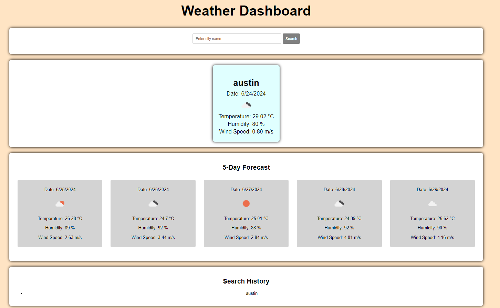

# Weather-Dashboard

## Description
This application is designed to show you the weather forecast for a specific city in mind. There are many like it, but this one is mine!

"You don't need a weatherman to know which way the wind blows!" - Bob Dylan

## Installation
N/A

## Usage
My live application can be found here: https://nhl1090.github.io/Weather-Dashboard/

Image:

## Credits
I referred to the following sites for guidance on the project:

- AccuWeather (https://www.accuweather.com/)
- edX (https://www.edx.org/)
- MDN (https://developer.mozilla.org/en-US/)
- National Weather Service (https://www.weather.gov/)
- OpenWeather (https://openweathermap.org/)
- Stackoverflow (https://stackoverflow.com/)
- The Weather Channel (https://weather.com/)
- UT Coding Bootcamp (https://git.bootcampcontent.com/University-of-Texas-at-Austin/UTA-VIRT-FSF-PT-05-2024-U-LOLC)
- W3 Schools (https://www.w3schools.com/)

## License
MIT License -- see details here: [text](LICENSE)